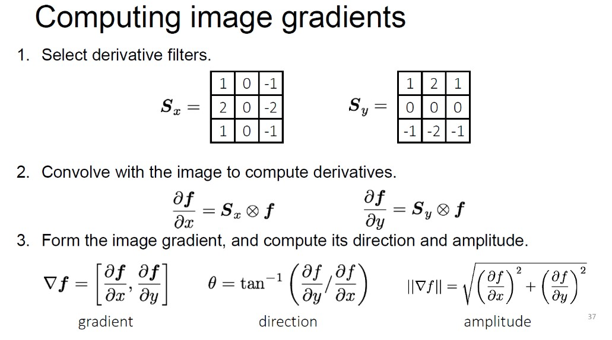
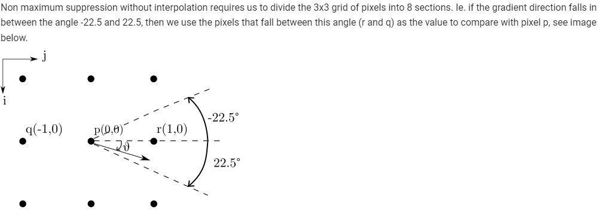
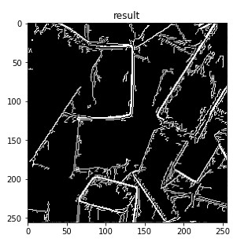

# -Artifical-Intelligence-in-Digital-Signal-Analysis-and-its-Applications-HW2

## Canny Edge Detector
### Step 1. Gaussian filter
### Step 2. Filter image with derivative of Gaussian

### Step 3. Non-maximum Suppression

### Step 4. Thresholding edges
### Step 5. Hysteresis
### Result

